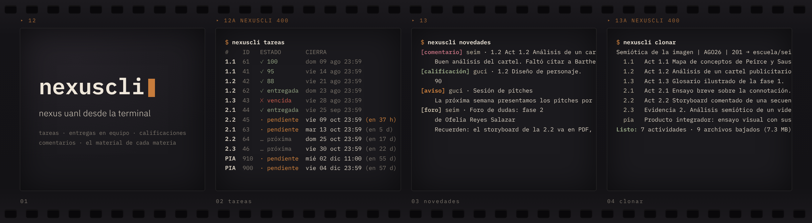
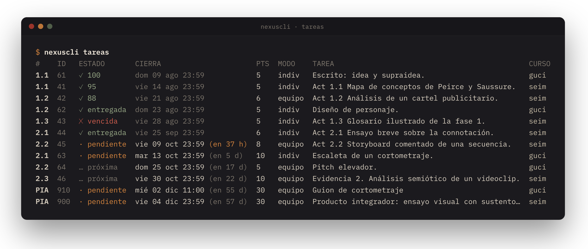
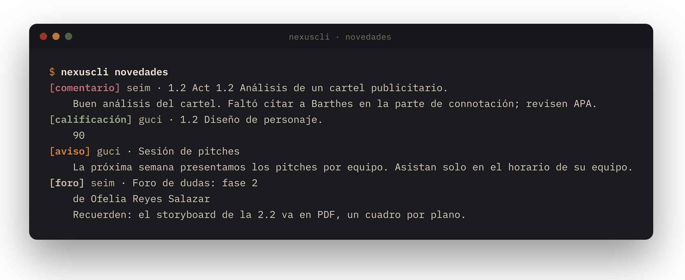
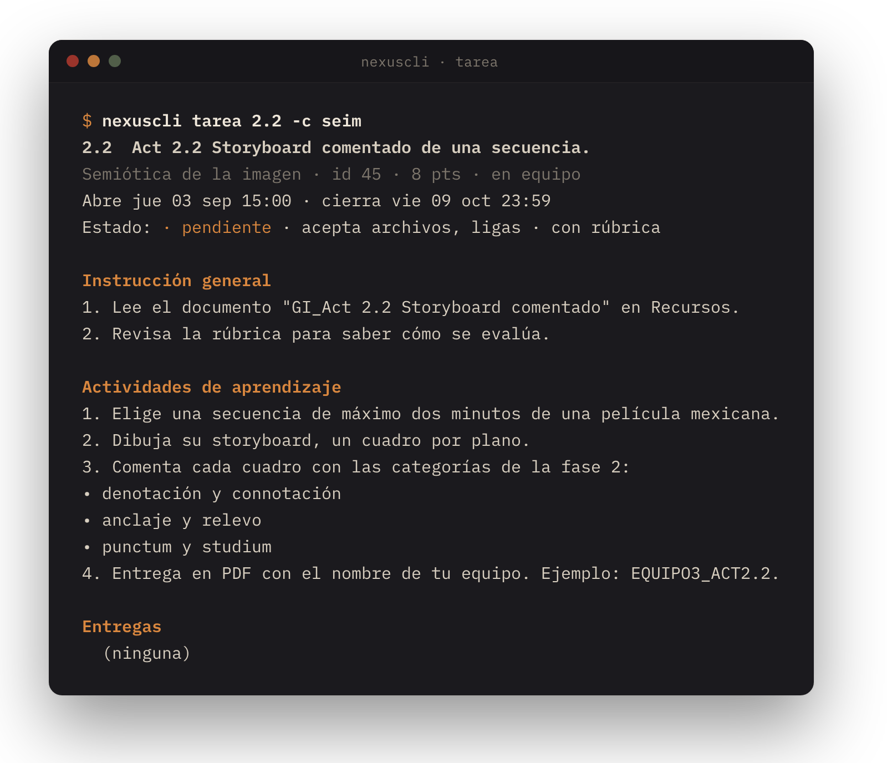
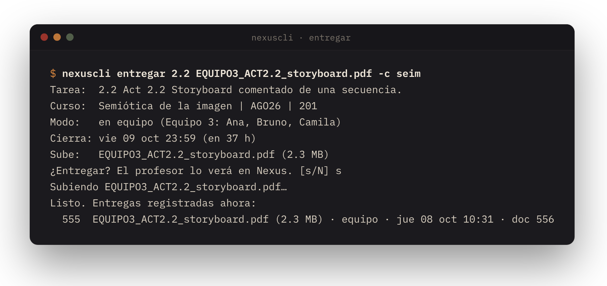
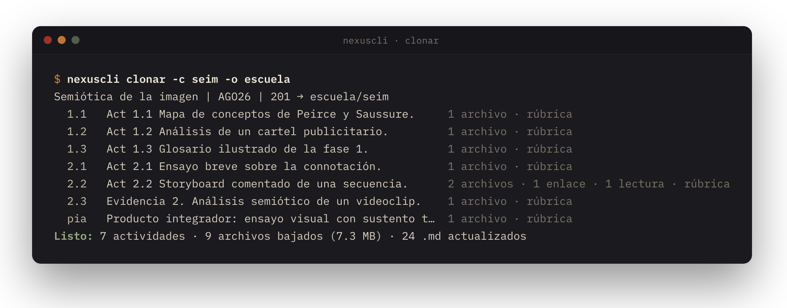
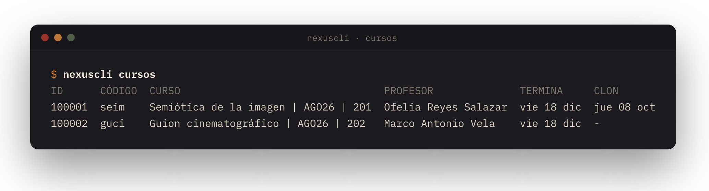

<p align="center">
  
</p>

<p align="center">
  <sub><b>nexus uanl desde la terminal.</b> tareas, entregas en equipo, calificaciones, comentarios del profe y el material de cada materia, sin abrir el navegador.</sub>
</p>

<p align="center">
  &nbsp;
  &nbsp;
  &nbsp;
  <a href="LICENSE"></a>&nbsp;
  <a href="https://github.com/donutinit/nexuscli/actions/workflows/tests.yml"></a>
</p>

<p align="center"></p>

`nexuscli` le habla directo al API que usa la página de [Nexus](https://plataformanexus.uanl.mx), la plataforma de clases de la UANL. Entra con tu matrícula y tu contraseña de SIASE sin abrir un navegador, así que lo puedes usar tú en la terminal o un agente como Claude o Codex que trabaje por ti.

<p align="center">
  
</p>

## qué hace

- Enseña tus tareas de todas las materias: estado, cierre, valor y si son en equipo.
- Abre una tarea con sus instrucciones completas, tus entregas y los comentarios del profe.
- Entrega archivos o ligas a tu nombre o por tu equipo, y borra entregas.
- Consulta calificaciones, avisos, foro y mensajes, y publica o responde en ellos.
- Te dice qué hay de nuevo desde la última vez que preguntaste.
- Copia el material de una materia a tu computadora: instrucciones, rúbricas, lecturas y archivos.

## instalación

Necesitas Python 3.12 o más nuevo. Con [uv](https://docs.astral.sh/uv/):

```sh
uv tool install git+https://github.com/donutinit/nexuscli
```

Con pipx:

```sh
pipx install git+https://github.com/donutinit/nexuscli
```

Para trabajar en el código:

```sh
git clone https://github.com/donutinit/nexuscli && cd nexuscli
uv sync
uv run nexuscli --help
```

Su única dependencia es [httpx](https://www.python-httpx.org).

## credenciales

`nexuscli` lee tu matrícula y tu contraseña de SIASE de `~/.config/nexuscli/credenciales`:

```sh
mkdir -p ~/.config/nexuscli
cat > ~/.config/nexuscli/credenciales <<'EOF'
NEXUS_USUARIO=1234567
NEXUS_PASSWORD=tu contraseña de SIASE
EOF
chmod 600 ~/.config/nexuscli/credenciales
nexuscli doctor
```

Si otro usuario de la computadora puede leer ese archivo, `nexuscli` se niega a usarlo. También acepta las variables de entorno `NEXUS_USUARIO` y `NEXUS_PASSWORD`, o `NEXUS_CREDENCIALES` con otra ruta. `nexuscli doctor` revisa las credenciales, la sesión y que el API responda.

## el día a día

```sh
nexuscli tareas               # todas, ordenadas por fecha de cierre
nexuscli tareas -p            # solo las que faltan
nexuscli tareas -s -c seim    # las que cierran esta semana en una materia
nexuscli tarea 2.2 -c seim    # instrucciones, entregas y comentarios
nexuscli calificaciones
nexuscli comentarios          # la retroalimentación de los profes
nexuscli avisos
nexuscli novedades
```

Las tareas se nombran como en la web (`2.2`, `PIA`), por su id o por un pedazo del nombre. Las materias van con `-c` y un pedazo del nombre, su id o su código. Si algo coincide con más de una, `nexuscli` te enseña las opciones.

`novedades` enseña lo que cambió desde la última vez que lo corriste: comentarios del profe, calificaciones, avisos, mensajes del foro, tareas nuevas y fechas que se movieron. La primera vez solo registra lo que ya existe, y una materia nueva aparece en una sola línea.

<p align="center">
  
</p>

<p align="center">
  
</p>

## entregar

```sh
nexuscli entregar 2.2 EQUIPO3_ACT2.2.pdf -c seim   # en tareas de equipo, entrega por el equipo
nexuscli entregar 2.2 borrador.pdf --individual    # solo a tu nombre
nexuscli liga 2.3 https://youtu.be/... -t "Video final"
nexuscli entregas 2.2                              # lo que ya está entregado
nexuscli borrar 2.2 555                            # por id de entrega, o --todas
```

Antes de subir algo, `nexuscli` enseña la tarea, tu equipo, cuándo cierra (y si ya cerró) y lo que ya estaba entregado, y te pide confirmar. Con `-y` no pregunta. Sin terminal, desde un script por ejemplo, no sigue si no le pasas `-y`. En una tarea de equipo hace lo mismo que la web: sube el archivo a la carpeta del equipo y lo vincula como entrega.

<p align="center">
  
</p>

Publicar en el foro (`comentar`), responder un comentario del profe (`responder`) y mandar mensajes (`enviar`, `escribir`) también piden confirmación.

## clonar el material de una materia

```sh
nexuscli clonar -c seim -o ~/escuela
```

<p align="center">
  
</p>

Crea `~/escuela/seim/` con una carpeta por actividad y una de generales:

```text
seim/
├── README.md                   índice: cierre, puntos, modalidad, recursos y rúbrica de cada actividad
├── generales/                  programa analítico, bienvenida, avisos y lecturas de la materia
├── 2.2/
│   ├── instrucciones.md
│   ├── rubrica.md
│   ├── recursos.md             archivos, enlaces y lecturas de la pestaña Recursos
│   ├── GI_Act 2.2 guía de la actividad.pdf
│   └── Barthes - Retórica de la imagen.pdf
├── 2.3/ …
└── pia/
```

Si lo vuelves a correr, solo baja lo que falta o cambió en Nexus. Nunca borra: los archivos que agregues a una carpeta se quedan ahí y aparecen en su `recursos.md`. Con `--personal` suma tu calificación, el nivel que te marcó el profe en cada criterio de la rúbrica, sus comentarios y tus entregas.

<details>
<summary>así queda una rúbrica</summary>

> **Rúbrica · 2.2 · Act 2.2 Storyboard comentado de una secuencia.**
>
> 3 criterios · niveles: Excelente, Suficiente, Insuficiente · máximo 100 puntos
>
> | Criterio | Excelente | Suficiente | Insuficiente |
> | --- | ---: | ---: | ---: |
> | Selección de la secuencia | 30 | 20 | 10 |
> | Storyboard | 30 | 20 | 10 |
> | Comentario semiótico | 40 | 25 | 10 |
>
> **1. Selección de la secuencia**
>
> - **Excelente · 30**: Secuencia pertinente y justificada.
> - **Suficiente · 20**: Pertinente sin justificar.
> - **Insuficiente · 10**: No se justifica.

</details>

## materias y códigos

Cada materia puede tener un código corto, como `seim` o `guci`, que sirve en `-c` y le da nombre a su carpeta al clonar. `nexuscli cursos` enseña el código de cada materia, o una propuesta con `?` si todavía no tiene. `nexuscli codigo <materia> <código>` lo confirma y `nexuscli codigo --aceptar` acepta todas las propuestas. Los códigos se guardan en `~/.config/nexuscli/materias`.

<p align="center">
  
</p>

Nexus deja de mostrar una materia poco después de que termina. Desde tres semanas antes, `novedades`, `tareas` y `cursos` avisan si no la has clonado o si tu copia tiene más de una semana, y te dan el comando para actualizarla.

## para agentes

`nexuscli` se hizo para que un agente de IA pueda usar Nexus por la persona. Todos los comandos aceptan `--json` y regresan la información completa:

```sh
nexuscli tareas -p --json | jq '.[] | {clave, nombre, fin, estado}'
nexuscli api Curso/ConsultarDetalleCurso '{"CursoId": 100001}'
```

`nexuscli api` llama cualquier método de lectura (`Consultar*`) del API. Los que modifican algo exigen `--escribir` y confirmación. Leer no tiene restricciones; entregar, borrar o publicar necesita `-y`, y [AGENTS.md](AGENTS.md) le pide al agente usarlo solo cuando la persona se lo pidió.

## cómo funciona

Para entrar, `nexuscli` pide la página de SIASE, manda el formulario y saca de la respuesta el parámetro con el que SIASE abre Nexus; `Seguridad/CrearSesionSIASE` lo cambia por un token. Todo es HTTP, sin navegador.

Cada operación es un `POST` a `https://api.nexus.uanl.mx/WebApi/<Dominio>/<Método>` con el token en los headers. Los cuerpos copian los que manda el frontend de Nexus, y [docs/api.md](docs/api.md) documenta los que usa `nexuscli`.

La sesión dura unas cinco horas y se renueva sola. Nexus admite una sola sesión por usuario: si `nexuscli` entra, se cierra la del navegador, y al revés. Cuando pasa, `nexuscli` vuelve a entrar solo.

Entre una llamada y otra espera un tiempo al azar, casi siempre alrededor de un segundo y de vez en cuando varios, sacado de la entropía del sistema operativo. `--pace` elige entre `rapido`, `normal` y `lento`.

## qué guarda y dónde

| archivo | contenido |
| --- | --- |
| `~/.config/nexuscli/credenciales` | tu matrícula y tu contraseña |
| `~/.config/nexuscli/materias` | los códigos de materia |
| `~/.local/state/nexuscli/sesion.json` | el token de la sesión |
| `~/.local/state/nexuscli/cache/` | tus materias y la estructura de cada una, por unas horas |
| `~/.local/state/nexuscli/visto.db` | huellas de lo que ya viste, para `novedades` |
| `~/.local/state/nexuscli/clones.json` | dónde y cuándo clonaste cada materia |

Todos tienen permisos 600 dentro de carpetas 700, así que solo tu usuario los lee. Las calificaciones y los comentarios se piden a Nexus cada vez y no se guardan; `visto.db` solo tiene huellas (hashes) para saber qué cambió.

## desarrollo

```sh
uv sync
uv run pytest                            # sin red, contra un Nexus falso
uv run python docs/capturas/generar.py   # regenera las imágenes de este README
```

Las capturas salen del CLI real corriendo contra el Nexus de mentira de [docs/capturas/demo.py](docs/capturas/demo.py). Las materias, profes y compañeros que aparecen en ellas son inventados.

## aviso

`nexuscli` no es de la UANL ni está respaldado por ella. Usa tus propias credenciales, y lo que hagas con él lo registra Nexus igual que si lo hicieras en la página. Si Nexus cambia su API, algo puede dejar de funcionar; [docs/api.md](docs/api.md) es el punto de partida para arreglarlo.

Las lecturas están probadas contra Nexus. Entregar, borrar y publicar copian campo por campo lo que manda la página y tienen tests, pero todavía no se han probado contra el servidor real: revisa en la web tu primera entrega.

<p align="center"></p>

<p align="center"><sub>licencia MIT · <a href="https://github.com/donutinit">donutinit</a></sub></p>
